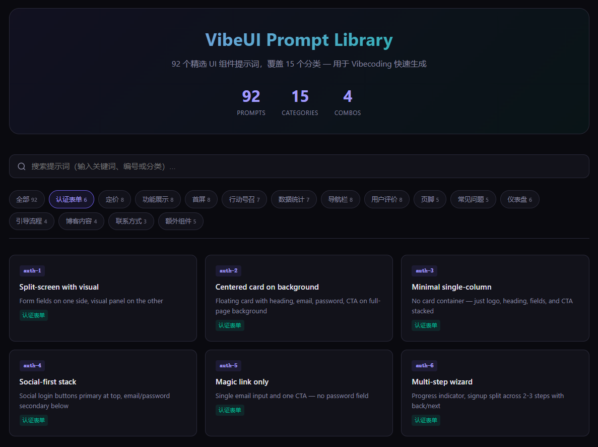
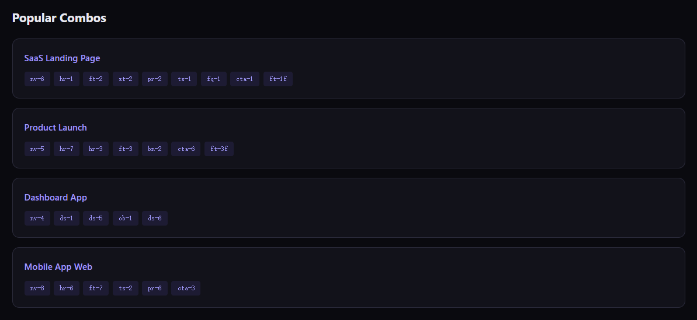
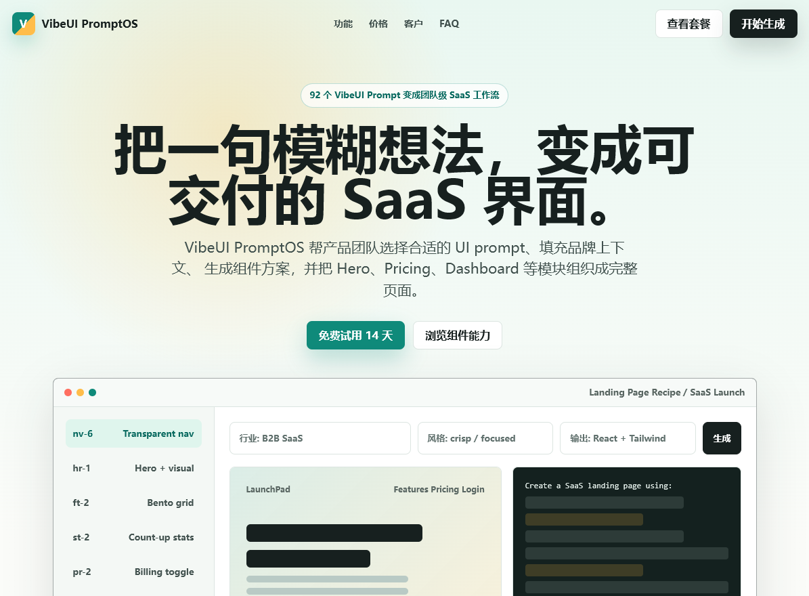
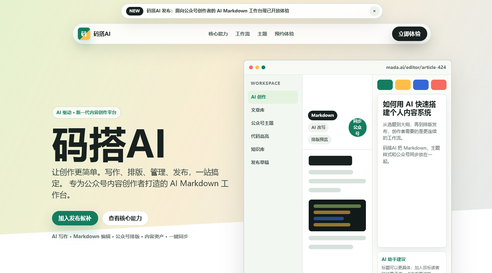
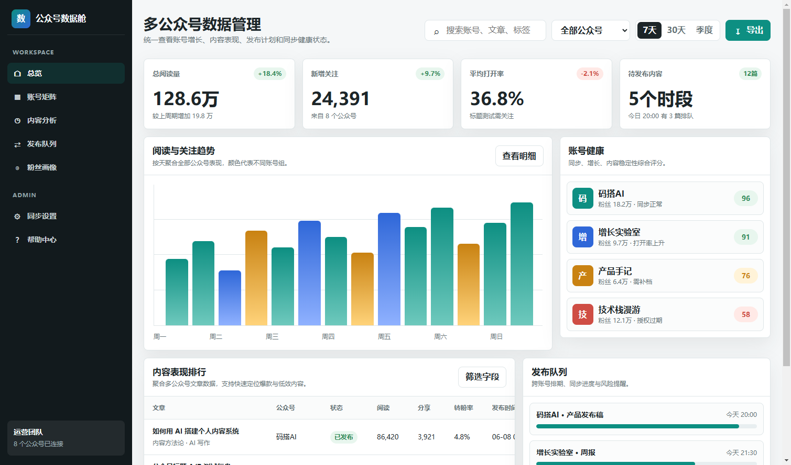

# xmsumi-vibeui-prompts

> 92 个精选 UI 组件提示词，覆盖 15 个分类 — 用于 Vibecoding 快速生成生产级 UI 组件

**[English](README.md)**

VibeUI 提示词库，专为 AI 辅助编码（Vibecoding）场景设计。通过结构化的提示词模板，快速生成 Hero、Pricing、Nav、Dashboard 等常见 UI 组件，支持截图风格匹配和自定义设计系统。

## Features

- **92 个提示词模板** — 覆盖认证表单、定价页、首屏、导航栏、仪表盘等 15 个 UI 分类
- **截图风格匹配** — 配合设计稿截图，AI 自动匹配颜色、字体、间距等视觉风格
- **自定义设计系统** — 无截图时支持指定 color palette、font family、border-radius 等设计令牌
- **页面组合方案** — 内置 SaaS Landing Page、Product Launch、Dashboard App 等 4 套常用组合
- **交互式浏览器** — 内置 HTML 展示页，支持分类筛选、关键词搜索、一键复制提示词
- **Agent Skill 格式** — 兼容 Qoder / Claude Code 等 AI IDE 的 Skill 规范，即装即用

## Screenshots

### Prompt 分类浏览



### Popular Combos 组合方案



## Demo Examples

使用本 Skill 生成的实际页面效果：

### SaaS Landing Page

> 组合：`nv-6` + `hr-1` + `ft-2` + `st-2` + `pr-2` + `ts-1` + `fq-1` + `cta-1` + `ft-1f`

[查看源码](assets/vibeui-saas-landing.html)



### More Examples

<table>
<tr>
<td width="50%">
<b>AI Product Launch</b><br>
<a href="assets/mada-ai-product-launch.html">查看源码</a><br>

</td>
<td width="50%">
<b>WeChat Multi-Account Dashboard</b><br>
<a href="assets/wechat-multi-account-dashboard.html">查看源码</a><br>

</td>
</tr>
</table>

## Categories

| 分类 | 数量 | 编号范围 | 适用场景 |
|------|------|----------|----------|
| Auth Forms 认证表单 | 6 | `auth-1` ~ `auth-6` | 登录、注册、认证页面 |
| Pricing 定价 | 8 | `pr-1` ~ `pr-8` | 定价页、套餐对比 |
| Features / Bento 功能展示 | 8 | `ft-1` ~ `ft-8` | 功能介绍、产品亮点 |
| Hero Sections 首屏 | 8 | `hr-1` ~ `hr-8` | 落地页头部、第一印象 |
| CTA Banners 行动号召 | 7 | `cta-1` ~ `cta-7` | 转化区块、号召按钮 |
| Stats Bars 数据统计 | 7 | `st-1` ~ `st-7` | 数据指标、社会证明 |
| Nav Bars 导航栏 | 8 | `nv-1` ~ `nv-8` | 导航菜单、侧边栏 |
| Testimonials 用户评价 | 8 | `ts-1` ~ `ts-8` | 客户评价、口碑展示 |
| Footer 页脚 | 5 | `ft-1f` ~ `ft-5f` | 页面底部 |
| FAQ 常见问题 | 5 | `fq-1` ~ `fq-5` | FAQ 区块、帮助中心 |
| Dashboards 仪表盘 | 6 | `ds-1` ~ `ds-6` | 后台面板、管理应用 |
| Onboarding 引导流程 | 4 | `ob-1` ~ `ob-4` | 新用户引导、空状态 |
| Blog / Content 博客内容 | 4 | `bl-1` ~ `bl-4` | 博客布局、内容页面 |
| Contact 联系方式 | 3 | `ct-1` ~ `ct-3` | 联系表单、客服页面 |
| Bonus 额外组件 | 5 | `bn-1` ~ `bn-5` | 对比表、404、Cookie、加载态 |

## Popular Combos

```
SaaS Landing Page:
nv-6 + hr-1 + ft-2 + st-2 + pr-2 + ts-1 + fq-1 + cta-1 + ft-1f

Product Launch:
nv-5 + hr-7 + hr-3 + ft-3 + bn-2 + cta-6 + ft-3f

Dashboard App:
nv-4 + ds-1 + ds-5 + ob-1 + ds-6

Mobile App Web:
nv-8 + hr-6 + ft-7 + ts-2 + pr-6 + cta-3
```

## Installation

### Qoder (推荐)

将本仓库克隆或复制到项目的 `.qoder/skills/` 目录：

```bash
# 项目级安装
git clone https://github.com/xmsumi/xmsumi-vibeui-prompts.git .qoder/skills/xmsumi-vibeui-prompts

# 全局安装
git clone https://github.com/xmsumi/xmsumi-vibeui-prompts.git ~/.qoder/skills/xmsumi-vibeui-prompts
```

### Claude Code

将 `SKILL.md` 放入 `.claude/skills/` 目录即可。

## Usage

### 在 AI IDE 中使用

安装后，在对话中直接说：

```
帮我做一个 SaaS 落地页
```

```
我需要一个 pricing section
```

```
用 vibeui 生成一个 hero，要分屏布局
```

AI 会自动从提示词库中匹配最合适的模板，并根据你的内容生成完整组件代码。

### 配合截图使用

1. 准备一张设计稿截图
2. 告诉 AI 使用哪个模板编号（如 `hr-2`）
3. AI 会自动匹配截图中的视觉风格生成代码

### 直接使用提示词

打开 `prompts-index.md` 或 `assets/prompt-explorer.html` 浏览所有提示词，复制后直接使用：

```
Create a hero section as a split layout — heading, subheading, and CTAs on one side,
and a product mockup or visual on the other.
Use Inter font, #6366f1 primary color, 12px border-radius, soft shadows.
```

### 自定义风格后缀

**有截图时**（默认）：
> Match the visual style, colors, typography, and overall aesthetic of the UI shown in my screenshot.

**无截图时**（替换为具体设计令牌）：
> Use Inter font, #6366f1 primary, #f8fafc background, 12px border-radius, 0 4px 6px rgba(0,0,0,0.1) shadows.

## Project Structure

```
xmsumi-vibeui-prompts/
├── SKILL.md                                    # Agent Skill 主文件（工作流 + 分类索引）
├── prompts-index.md                            # 92 个提示词完整参考
├── README.md                                   # 英文文档
├── README-CN.md                                # 中文文档（本文件）
└── assets/
    ├── prompt-explorer.html                    # 交互式提示词浏览器
    ├── vibeui-saas-landing.html / .png         # 示例：SaaS Landing Page
    ├── mada-ai-product-launch.html / .png      # 示例：AI Product Launch
    ├── wechat-multi-account-dashboard.html / .png  # 示例：WeChat Dashboard
    ├── ScreenShot_1.png                        # 分类浏览截图
    └── ScreenShot_2.png                        # Popular Combos 截图
```

## How It Works

所有 92 个提示词共享统一结构：

```
Create a [组件类型] as [布局模式].
[具体内容和结构描述].
[风格匹配指令].
```

**工作流**：

1. **识别需求** — 用户描述需要什么 UI 区块
2. **匹配模板** — 从对应分类中选择最合适的布局
3. **定制生成** — 替换占位内容，附加框架偏好（React/Vue/Tailwind 等）
4. **组合页面** — 多个模板串联，生成完整页面

## Prompt Explorer

内置的 `assets/prompt-explorer.html` 是一个独立的交互式页面：

- 暗色主题 + 渐变高亮
- 16 个分类标签快速切换
- 关键词搜索（支持编号、名称、描述）
- 点击卡片查看完整提示词
- 一键复制到剪贴板
- 底部展示 4 套 Popular Combos

可直接在浏览器中打开，也可通过 `show_widget` 在 AI IDE 中内嵌展示。

## License

MIT

## 作者

- 网站：[xmsumi.com](https://www.xmsumi.com/)
- GitHub：[github.com/xmsumi](https://github.com/xmsumi)
